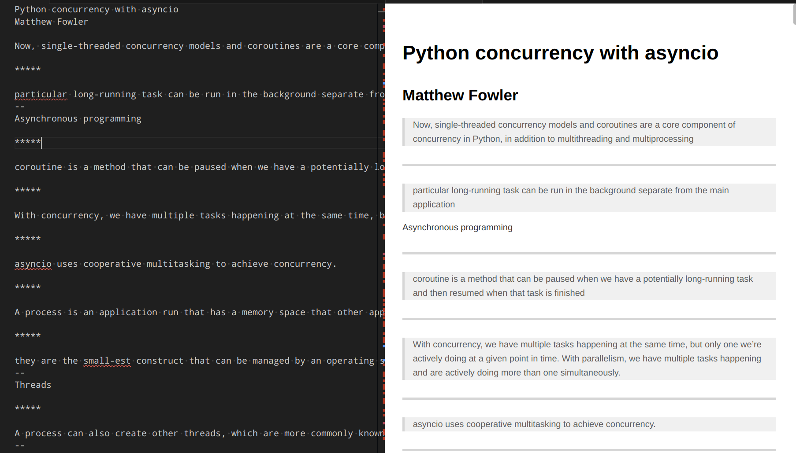

# ReadEra quotes formatter for Markdown (Notion)

Script to export ReadEra quotes to MD format used in Notion.



## Install

At least Python3.8 should be installed.

Clone the repository.

```bash
git clone https://github.com/balancy/readera_quotes_to_markdown.git
```

# Run

```bash
python3 format_quotes.py
```

Script uses arguments:

`-i` - input file with quotes, by default "quotes.txt"
`-o` - output file with Markdown, by default "quotes.md"

If there is a need to change arguments, one can use:

```bash
python3 format_quotes.py -i `some_input.txt` -o `some_output.md`
```